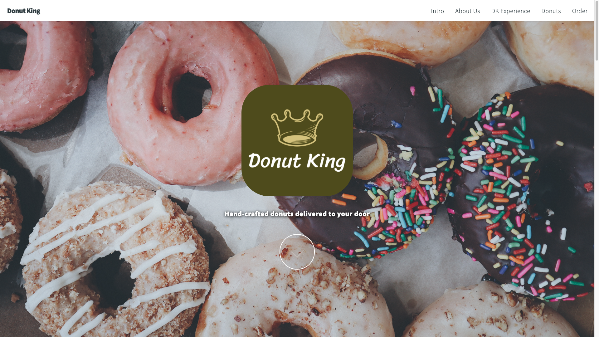

# Coiffeur : <a target="_blank" href="https://coiffeur.netlify.app/">Visit Here</a>

### A fully responsive, beautiful, and modern website for an on-trend full-service salon.

## Tech used: 

My focus was to practice JavaScript to create eye-catching transitions.

## Optimizations

My next steps for improving this project would be to add more pages and more detail to each existing page.

## Lessons Learned:

I learned that creating a successful project, isn't determined by it's complexity.

## More Projects

<table bordercolor="#66b2b2">
  
  <tr>
    <td width="33.3%"  style="align:center;" valign="top">
<a target="_blank" href="https://github.com/Cesar-Quintero/Cesar-Quintero-Portfolio-Website">Portfolio Website</a>
         
      
    </td>
    <td width="33.3%" valign="top">
<a target="_blank" href="https://github.com/Cesar-Quintero/donut-king">Donut King</a>
       
        
    </td>
    <td width="33.3%" valign="top">
<a target="_blank" href="https://github.com/Cesar-Quintero/Market_List_App">Market List App</a>
         
      
    </td>
  </tr>
</table>